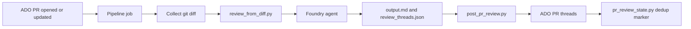

# PR Review Agent for Azure DevOps

An AI-powered pull request reviewer for Azure DevOps, built for engineers who like automation but still trust human judgment.

This repo is a reference implementation of a practical workflow:
- Read PR diffs
- Ask a Foundry agent for structured findings
- Post inline and summary comments back to the PR
- Avoid duplicate review spam across reruns

This repository is intended for teams that want consistent, automated first-pass PR analysis in Azure DevOps.

## What This Project Does

- Uses an Azure AI Foundry agent for code review reasoning
- Supports two pipeline modes:
- Gated mode for PR-triggered review
- On-demand mode for any pasted Azure DevOps PR URL
- Converts model output into ADO PR threads (inline + summary)
- De-duplicates repeat findings with review state markers
- Snaps inline comment anchors to real added lines in unified diffs

## Architecture



## Repository Layout

- pr-review-gated.yml: Reusable review job template
- pr-review-on-demand.yml: Manual pipeline that accepts a PR URL
- requirements.txt: Python dependencies
- scripts/create_agent.py: Creates a versioned Foundry agent
- scripts/review_from_diff.py: Sends diff to model and writes review output
- scripts/diff_inline_lines.py: Aligns inline thread line numbers to diff additions
- scripts/post_pr_review.py: Posts review threads to Azure DevOps PR API
- scripts/pr_review_state.py: Dedup logic and review marker handling
- scripts/resolve_pr_from_url.py: Resolves browser PR URL to API/env context
- scripts/.env.example: Local env template

## Prerequisites

- Python 3.11+
- Azure subscription and Azure AI Foundry project
- An Azure DevOps project with PRs enabled
- Permission to post PR comments/threads

## 1) Install Dependencies

```bash
python -m pip install --upgrade pip
pip install -r requirements.txt
```

## 2) Configure Environment

Copy scripts/.env.example to scripts/.env and fill values:

- PROJECT_ENDPOINT
- PR_RVW_MODEL_DEPLOYMENT_NAME
- PR_RVW_AGENT_NAME (optional, defaults to pr-review-agent)

Example values are already provided in scripts/.env.example.

## 3) Create (or Version) the Foundry Agent

```bash
python scripts/create_agent.py
```

This creates a new version for the same logical agent name, so prompt evolution is traceable.

## 4) Local Dry Run From a Diff

Generate a diff file and run review locally:

```bash
git diff origin/develop...HEAD > changes.txt
python scripts/review_from_diff.py changes.txt output.md
```

Optional behavior:
- PR_REVIEW_INLINE_JSON=1 to also emit review_threads.json
- PR_REVIEW_SNAP_THREAD_LINES=1 to snap line anchors to real + lines (default on)

## 5) Post Threads to a PR (Manual Local Test)

Set one of:
- ADO_THREADS_URL directly, or
- ADO_ORG + ADO_PROJECT + ADO_REPO_ID + ADO_PR_ID

Then:

```bash
python scripts/post_pr_review.py review_threads.json
```

Required auth env:
- ADO_ACCESS_TOKEN or SYSTEM_ACCESSTOKEN

## Azure DevOps Pipeline Usage

### Gated pipeline template

Use pr-review-gated.yml as the core review job. It:
- Fetches the target branch
- Computes full or incremental diff
- Runs review_from_diff.py
- Posts inline threads with post_pr_review.py
- Stamps summary marker for dedup

### On-demand pipeline

Use pr-review-on-demand.yml for manual execution with a PR URL parameter.
It resolves the PR context, clones the target repo, and runs the same review flow.

## Required Variable Group in ADO

Create a variable group named pr-review-agent-vars with:
- AZURE_SERVICE_CONNECTION
- PROJECT_ENDPOINT
- PR_RVW_AGENT_NAME
- PR_RVW_MODEL_DEPLOYMENT_NAME

Also enable: Allow scripts to access OAuth token.

## Why The Dedup Logic Matters

Without dedup, reruns can flood a PR with repeated comments.
This repo stamps a marker in PR summary comments:

- [pr-review-agent] reviewed-commit: <sha>

If the same commit has already been reviewed on that PR, posting is skipped.

## Review Policy

This agent is tuned for signal over noise:
- High severity can be inline
- Medium and low are grouped in summary
- Every claim should be grounded in visible diff evidence

This policy is designed to improve signal quality and reduce review noise.

## Troubleshooting

- No output in output.md: check PROJECT_ENDPOINT and Foundry auth context
- Inline comments fail to post: verify ADO token scopes and ADO_THREADS_URL format
- Comments appear on wrong lines: keep PR_REVIEW_SNAP_THREAD_LINES enabled
- Review repeats on rerun: ensure PR_REVIEW_SKIP_DEDUP is not set to true

## Security Notes

- Keep tokens in secure pipeline variables or Key Vault
- Do not commit scripts/.env
- Treat model output as advisory, not merge authority

## Suggested Next Enhancements

- Add path-based ownership policies (security files reviewed with stricter prompt)
- Add a "tests missing" heuristic score
- Add markdown artifacts upload for auditability
- Add a fallback compact review mode for huge diffs

## License

Add your preferred license file before publishing the reference repo.
